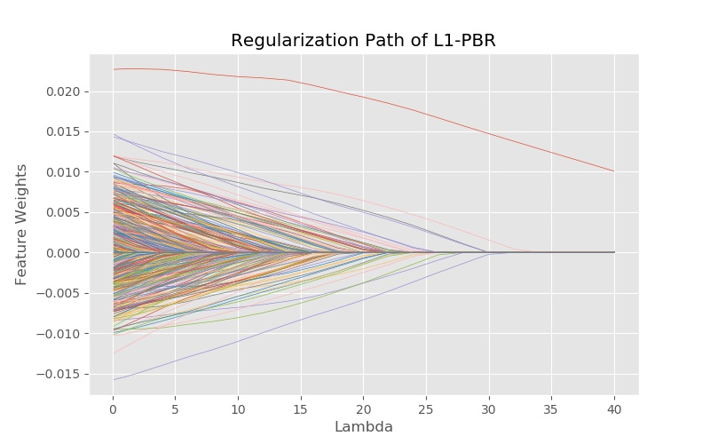
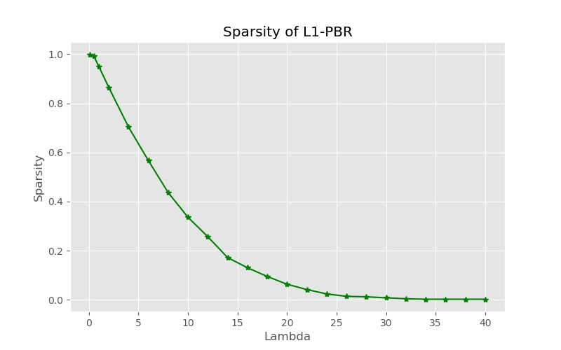
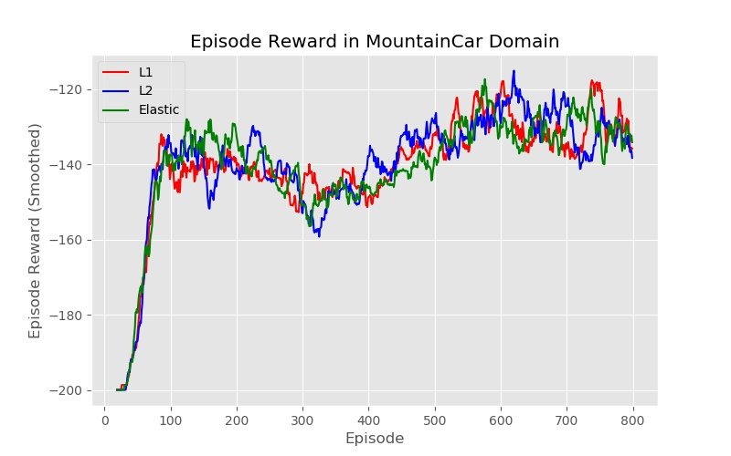
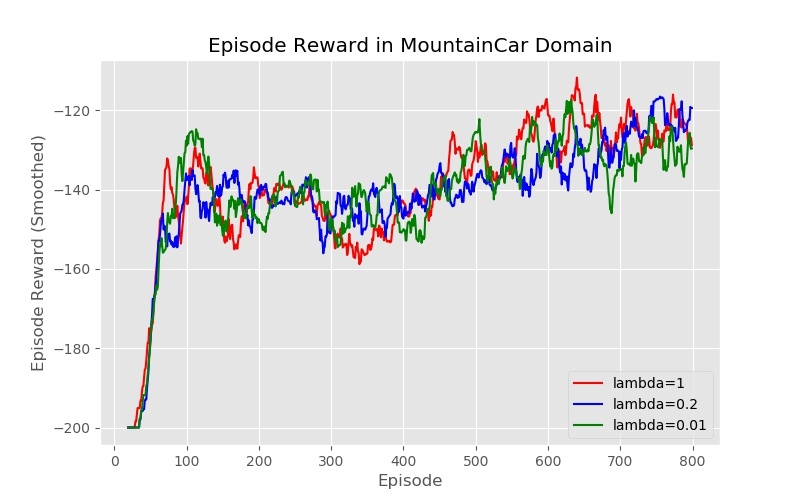
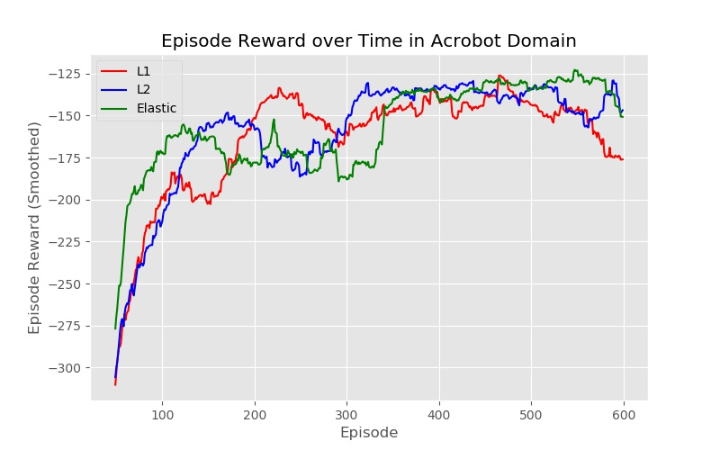
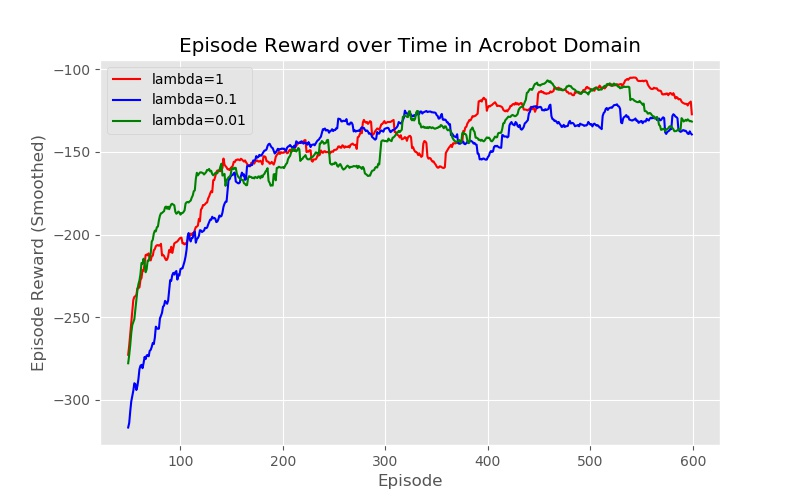

### Regularized Function Approximation in Reinforcement Learning

##### The experiment contains 2 parts. 

Batch method: L1 regularized LSTD, in Chainwalk Domain

Incremental method: adding L1 penalty to SGD update, in Mountain Car and Acrobot Domain from OpenAI Gym.

##### Output figures:

Batch method:

Incremental method:

